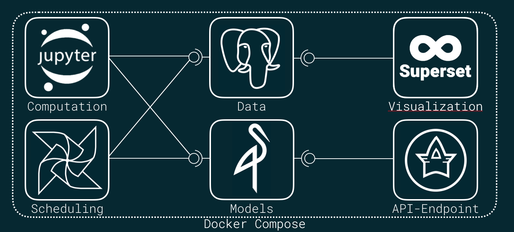

# Data Science Stack - Cookiecutter
Cookiecutter to launch an awesome Data Science toolstack in Docker.

# See it in action

# Overall Architecture

# Used Variables
The following table provides an overview about parameter, that are queried by cookiecutter (and why)

| Name | Description | Injected in Services |
| --- | --- | --- | 
| **project_name** | *Name of your project* | - |
| **jupyter_password** | *Password to protect your Jupyter service* | Jupyter |
| **postgres_db_password** | *Password of standard postgres user* | Postgres |
| **shared_db_password** | *Password for shared database* | Airflow Jupyter Postgres |
| **superset_db_password** | *Password for superset database* | Postgres Superset |
| **superset_admin_password** | *Password for superset admin user* | Superset |
| **minio_access_key** | *Access key for Minio store* | Airflow Apistar Jupyter Minio |
| **minio_secret_key** | *Secret key for Minio store* | Airflow Apistar Jupyter Minio |
